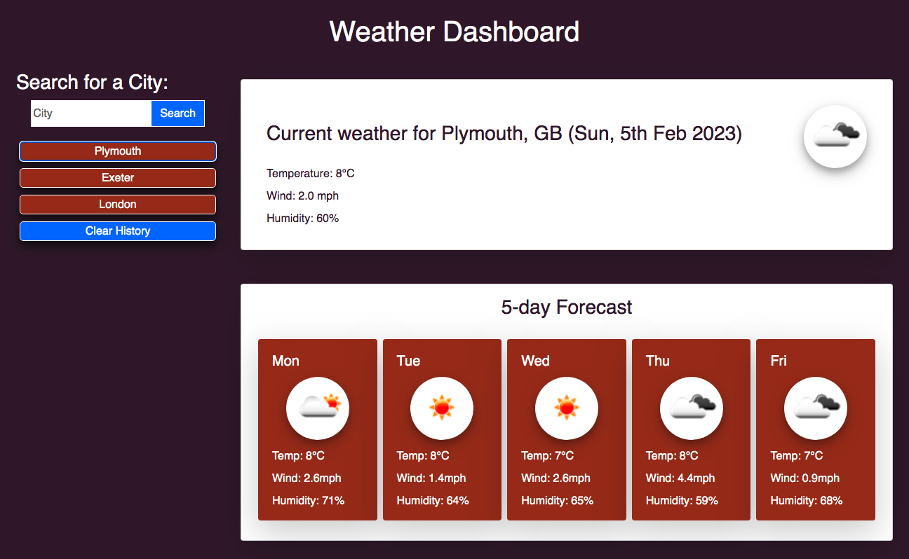

# Weather Forecast App

## A simple weather forecasy app which allows users to search for the weather in a chosen city, using JavaScript and CSS to interact with the html elements on the page

<!-- TABLE OF CONTENTS -->
<details>
  <summary>Table of Contents</summary>
  <ol>
        <li><a href="#about-the-project">About The Project</a></li>
        <li><a href="#deployment">Deployment / Code Repository</a></li>
        <li><a href="#screenshot">Screenshot</a></li>
        <li><a href="#scope-and-purpose">Scope and Purpose</a></li>
        <li><a href="#usage">Usage</a></li>
        <li><a href="#installation">Installation</a></li>
        <li><a href="#pseudocode">Pseudocode</a></li>
        <li><a href="#overview-of-build">Overview of Build</a></li>
        <li><a href="#suggested-future-changes">Suggested Future Changes</a></li>
        <li><a href="#license">License</a></li>
      </ol>
</details>

<!-- About the Project -->

## About the Project

### Deployment / Code Repository

[Live deployment](https://tweetingcynical.github.io/weather-app/)

[Repository](https://github.com/TweetingCynical/weather-app)

### Screenshot

Working version of site should look like this at standard screen size:


### Scope and Purpose

Build an interactive Weather Forecase App which utilises openweathermap api, and presents data for the current moment, and also the 5 days ahead.

### Usage

This site and its codeset are for educational purposes only.

### Installation

No installation required. Users can search for a city, or press the button of a city they have previously searched for.

<!-- Pseudocode and overview of build -->

## Pseudocode

Steps to achieving the working Weather Forecase App:

- Check localStorage for stored history;
  - If there is history, create the buttons for each city using a for loop;
- Add a searched city to local storage history when a city is searched;
  - Create a new button when that city is searched;
- Create api search term and change from city to co-ordinates;
- Use api data to get weather information for current weather:
  - TODAY SECTION:
  - Create a title, icon, temp, wind and humidity element;
  - Fill those elements with data from api;
  - Append to TODAY section;
  - FORECAST SECTION:
  - Filter out records in api data that are not necessary;
  - For loop to create a card for each of the next 5 days;
  - Create a title, icon, temp, wind and humidity element;
  - Fill those elements with data from api;
  - Append to FORECAST section;
- Add event listeners to buttons from search history, so that when they are clicked, they call the same function as the search button

## Overview of Build

Some of the key JavaScript skills being utilised:

- Use of local storage to store previously searched cities:

  ```javascript
  function checkHistory() {
    let searched = localStorage.getItem("searched");

    if (searched) {
      userHistory = JSON.parse(searched);
    }
    createButtons();
  }
  ```

- Use of jQuery's ajax to get api data for use in the app:

  ```javascript
  function getCoordinates(city) {
    let queryCoordinatesURL = `${initAPIURL}/geo/1.0/direct?q=${city}&limit=5&appid=${myKey}`;

    $.ajax({
      url: queryCoordinatesURL,
      method: "GET",
    }).then(function (data) {
      if (!data[0]) {
        alert("This city was not found. Please try again.");
      } else {
        appendHistory(city);
        getWeather(data[0]);
      }
    });
  }
  ```

- Use of moment.js to handle date formatting:

  ```javascript
  const displayDateC = moment().format("ddd, Do MMM YYYY"); // Sun, 5th Feb 2023
  const displayDateF = moment(
    dailyForecast[i].dt_txt,
    "YYYY-MM-DD HH:mm:ss"
  ).format("ddd"); // Mon
  ```

- Use of stored api information to create image icons:

  ```javascript
  const icon = `${initAPIURL}/img/w/${weatherInfo.weather[0].icon}.png`;
  ```

- Use of .filter() and .includes() to remove all api data that relates to times we do not wish to display in the site:

  ```javascript
  let dailyForecast = weatherInfo.filter(function (info) {
    return info.dt_txt.includes("12:00:00");
  });
  ```

- Use of .hasClass to check information about the button being clicked, and use it to decide what action to take:

  ```javascript
  function historyClick(event) {
    if (!$(event.target).hasClass("btn-main")) {
      return;
    }
    let city = $(event.target).attr("id");
    getCoordinates(city);
    input.val("");
  }
  ```

### Suggested future changes

- Add a map section so that user can visually see that they have chosen the correct city;
- Add an option to select a different city than the first in the api list;
- ✅ ~~Add button to clear history from localStorage;~~
- Adjust .filter() .includes() to take into account the timezone of the city searched for;

## License

MIT License

Copyright (c) 2022 TweetingCynical

Permission is hereby granted, free of charge, to any person obtaining a copy of this software and associated documentation files (the "Software"), to deal in the Software without restriction, including without limitation the rights to use, copy, modify, merge, publish, distribute, sublicense, and/or sell copies of the Software, and to permit persons to whom the Software is furnished to do so, subject to the following conditions:

The above copyright notice and this permission notice shall be included in all copies or substantial portions of the Software.

THE SOFTWARE IS PROVIDED "AS IS", WITHOUT WARRANTY OF ANY KIND, EXPRESS OR IMPLIED, INCLUDING BUT NOT LIMITED TO THE WARRANTIES OF MERCHANTABILITY, FITNESS FOR A PARTICULAR PURPOSE AND NONINFRINGEMENT. IN NO EVENT SHALL THE AUTHORS OR COPYRIGHT HOLDERS BE LIABLE FOR ANY CLAIM, DAMAGES OR OTHER LIABILITY, WHETHER IN AN ACTION OF CONTRACT, TORT OR OTHERWISE, ARISING FROM, OUT OF OR IN CONNECTION WITH THE SOFTWARE OR THE USE OR OTHER DEALINGS IN THE SOFTWARE.
